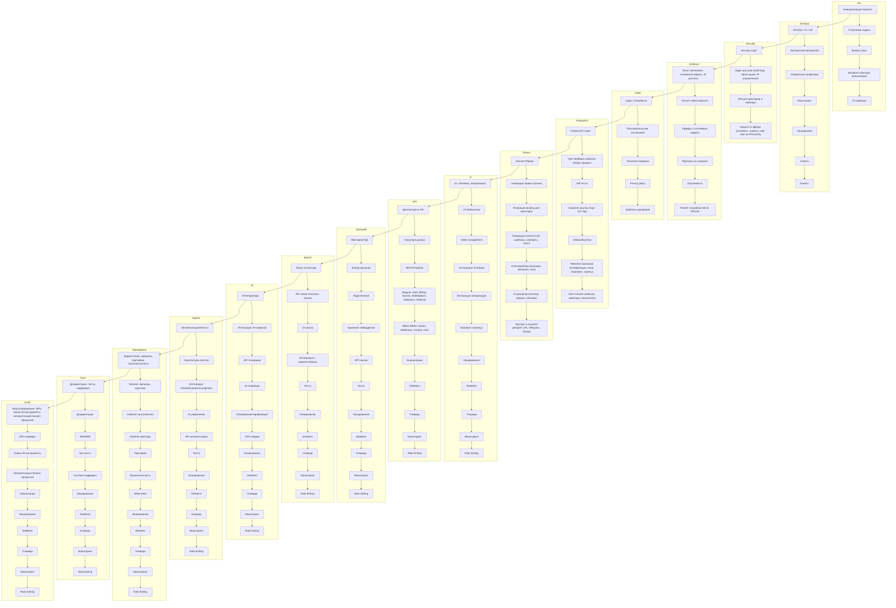

# Общий TODO проекта

- [x] Инициализация проекта
- [ ] DevOps / CI / CD
- [ ] Security Layer
- [ ] Юнит-экономика, платёжная модель, AI-расчёты
- [ ] Legal / Compliance
- [ ] Product/UX Layer
- [ ] Контент/Промо
- [ ] UI, платёжки, авторизация
- [ ] Архитектура и API
- [ ] Векторная БД
- [ ] Поиск по вектору
- [ ] AI-генераторы
- [ ] Автоматизация/Агенты
- [ ] Маркетплейс, кабинеты, партнёрка, мультиязычность
- [ ] Документация, тесты, поддержка
- [ ] Масштабирование: GPU, новые AI-инструменты, автоматизация бизнес-процессов

