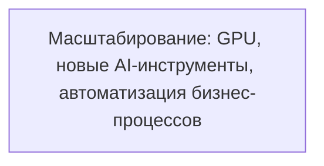

# TODO: Масштабирование: GPU, новые AI-инструменты, автоматизация бизнес-процессов

- [ ] Планирование закупки/развёртывания GPU-серверов
- [ ] Интеграция новых AI-инструментов
- [ ] Автоматизация бизнес-процессов (агенты, автоворонки, рассылки)
- [ ] Локализация под новые рынки (Казахстан, Беларусь, Бразилия и др.)
- [ ] Настроить кеширование (Redis, CDN, API-ответы)
- [ ] Заложить stateless-архитектуру для масштабирования
- [ ] Подключить очереди для фоновых задач (RabbitMQ/Redis Streams)
- [ ] Настроить мониторинг и алерты (Prometheus/Grafana/Sentry)
- [ ] Реализовать rate limiting и throttling для API

