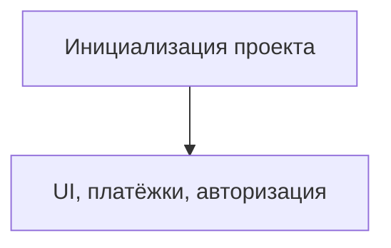

# TODO: Инициализация проекта

- [x] Создать новый репозиторий (GitHub/GitLab)
- [x] Инициализировать проект на Next.js (TypeScript)
- [x] Настроить TailwindCSS
- [x] Подключить shadcn/ui, Mantine или Radix UI
- [x] ESLint, Prettier, Husky
- [x] Настроить i18n (русский, английский, расширяемость)
- [x] Базовая структура папок (pages, components, modules, api, utils, locales)
- [x] CI/CD (GitHub Actions, Vercel/Render/Яндекс.Облако)
- [x] Настроить кеширование (Redis, CDN, API-ответы)
- [x] Заложить stateless-архитектуру для масштабирования
- [x] Подключить очереди для фоновых задач (RabbitMQ/Redis Streams)
- [x] Настроить мониторинг и алерты (Prometheus/Grafana/Sentry)
- [x] Реализовать rate limiting и throttling для API

