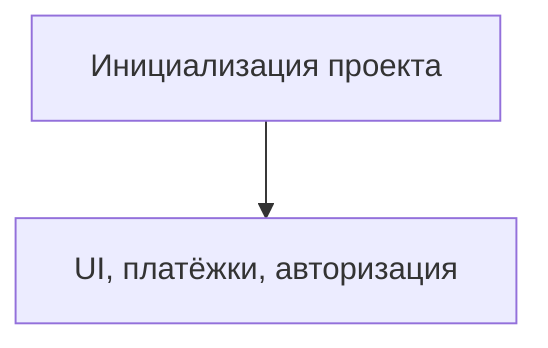

# TODO: Инициализация проекта

- [ ] Создать новый репозиторий (GitHub/GitLab)
- [ ] Инициализировать проект на Next.js (TypeScript)
- [ ] Настроить TailwindCSS
- [ ] Подключить shadcn/ui, Mantine или Radix UI
- [ ] ESLint, Prettier, Husky
- [ ] Настроить i18n (русский, английский, расширяемость)
- [ ] Базовая структура папок (pages, components, modules, api, utils, locales)
- [ ] CI/CD (GitHub Actions, Vercel/Render/Яндекс.Облако)
- [ ] Настроить кеширование (Redis, CDN, API-ответы)
- [ ] Заложить stateless-архитектуру для масштабирования
- [ ] Подключить очереди для фоновых задач (RabbitMQ/Redis Streams)
- [ ] Настроить мониторинг и алерты (Prometheus/Grafana/Sentry)
- [ ] Реализовать rate limiting и throttling для API

 