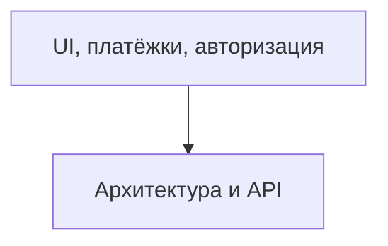

# TODO: UI, платёжки, авторизация

- [ ] Подключить UI-библиотеку (shadcn/ui, Mantine, Radix UI)
- [ ] Подключить state management (Zustand/Jotai/Redux)
- [ ] Интеграция с платёжками (ЮKassa, СБП, QIWI — заглушки)
- [ ] Интеграция авторизации (VK, Telegram, email)
- [ ] Настроить базовые страницы: login, register, dashboard
- [ ] Настроить кеширование (Redis, CDN, API-ответы)
- [ ] Заложить stateless-архитектуру для масштабирования
- [ ] Подключить очереди для фоновых задач (RabbitMQ/Redis Streams)
- [ ] Настроить мониторинг и алерты (Prometheus/Grafana/Sentry)
- [ ] Реализовать rate limiting и throttling для API
- [ ] Подключить Aceternity UI
- [ ] Настроить мультиязычность (next-i18next)

 