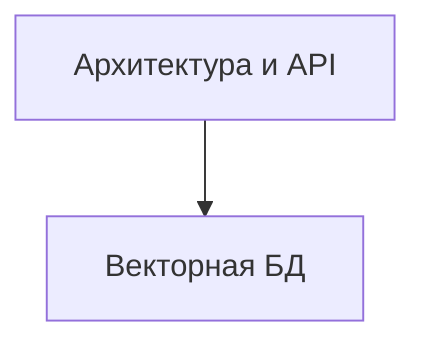

# TODO: Архитектура и API

- [ ] Проектирование структуры данных (продукты, пользователи, заказы, доступы, партнёрка)
- [ ] Проектирование API (REST/GraphQL)
- [ ] Абстракция для хранения эмбеддингов (векторная БД)
- [ ] Проектирование модулей: Auth, Billing, Access, Marketplace, Кабинеты, Referral
- [ ] Заложить масштабируемость (модульность, возможность вынести сервисы)
- [ ] Настроить кеширование (Redis, CDN, API-ответы)
- [ ] Заложить stateless-архитектуру для масштабирования
- [ ] Подключить очереди для фоновых задач (RabbitMQ/Redis Streams)
- [ ] Настроить мониторинг и алерты (Prometheus/Grafana/Sentry)
- [ ] Реализовать rate limiting и throttling для API

