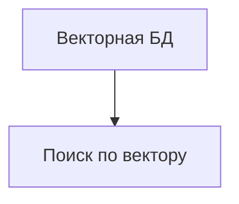

# TODO: Векторная БД

- [ ] Выбрать решение (Pinecone, Qdrant, Milvus, pgvector)
- [ ] Настроить подключение к векторной БД
- [ ] Реализовать хранение эмбеддингов (изображения, видео, текст)
- [ ] API для добавления/поиска по вектору
- [ ] Тесты на поиск и хранение
- [ ] Настроить кеширование (Redis, CDN, API-ответы)
- [ ] Заложить stateless-архитектуру для масштабирования
- [ ] Подключить очереди для фоновых задач (RabbitMQ/Redis Streams)
- [ ] Настроить мониторинг и алерты (Prometheus/Grafana/Sentry)
- [ ] Реализовать rate limiting и throttling для API

 