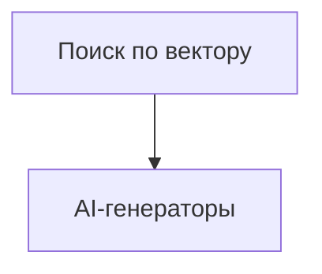

# TODO: Поиск по вектору

- [ ] API для семантического поиска (поиск похожих картинок/видео/продуктов)
- [ ] UI для поиска (интерфейс поиска по картинке/тексту)
- [ ] Интеграция с основным маркетплейсом
- [ ] Тесты на релевантность поиска
- [ ] Настроить кеширование (Redis, CDN, API-ответы)
- [ ] Заложить stateless-архитектуру для масштабирования
- [ ] Подключить очереди для фоновых задач (RabbitMQ/Redis Streams)
- [ ] Настроить мониторинг и алерты (Prometheus/Grafana/Sentry)
- [ ] Реализовать rate limiting и throttling для API

 