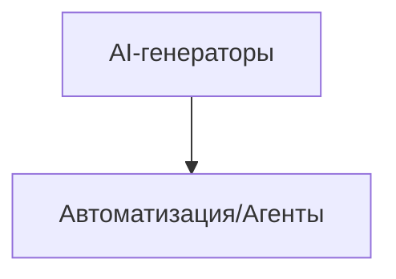

# TODO: AI-генераторы

- [ ] Интеграция с внешними AI-сервисами (Stable Diffusion, DALL-E, LLaMA, OpenVoice)
- [ ] API для генерации изображений/видео/текста
- [ ] UI для генерации (интерфейс для креаторов)
- [ ] Логирование и тарификация генераций
- [ ] Подготовка к запуску собственного GPU-сервера
- [ ] Настроить кеширование (Redis, CDN, API-ответы)
- [ ] Заложить stateless-архитектуру для масштабирования
- [ ] Подключить очереди для фоновых задач (RabbitMQ/Redis Streams)
- [ ] Настроить мониторинг и алерты (Prometheus/Grafana/Sentry)
- [ ] Реализовать rate limiting и throttling для API

