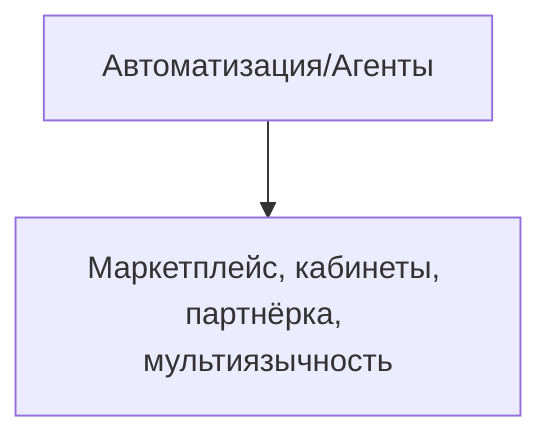

# TODO: Автоматизация/Агенты

- [ ] Архитектура для создания агентов (боты, скрипты, ассистенты)
- [ ] Интеграция с CrewAI, AutoGen, LangChain Agents (или аналогами)
- [ ] UI для управления агентами
- [ ] API для автоматизации бизнес-процессов
- [ ] Тесты и документация
- [ ] Настроить кеширование (Redis, CDN, API-ответы)
- [ ] Заложить stateless-архитектуру для масштабирования
- [ ] Подключить очереди для фоновых задач (RabbitMQ/Redis Streams)
- [ ] Настроить мониторинг и алерты (Prometheus/Grafana/Sentry)
- [ ] Реализовать rate limiting и throttling для API

 