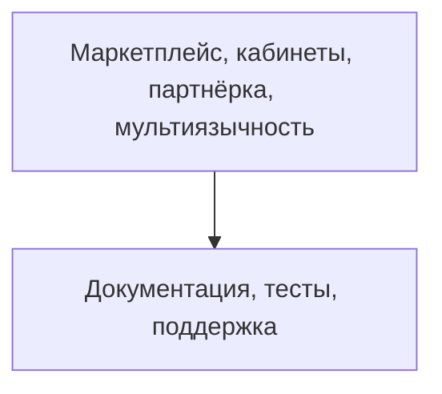

# TODO: Маркетплейс, кабинеты, партнёрка, мультиязычность

- [ ] Каталог, фильтры, карточки, поиск
- [ ] Личный кабинет пользователя (покупки, доступы, история)
- [ ] Личный кабинет креатора (продукты, продажи, аналитика)
- [ ] Партнёрка: трекинг рефералов, выплаты
- [ ] Мультиязычность: поддержка RU/EN, расширяемость
- [ ] White-label кастомизация
- [ ] Настроить кеширование (Redis, CDN, API-ответы)
- [ ] Заложить stateless-архитектуру для масштабирования
- [ ] Подключить очереди для фоновых задач (RabbitMQ/Redis Streams)
- [ ] Настроить мониторинг и алерты (Prometheus/Grafana/Sentry)
- [ ] Реализовать rate limiting и throttling для API

 