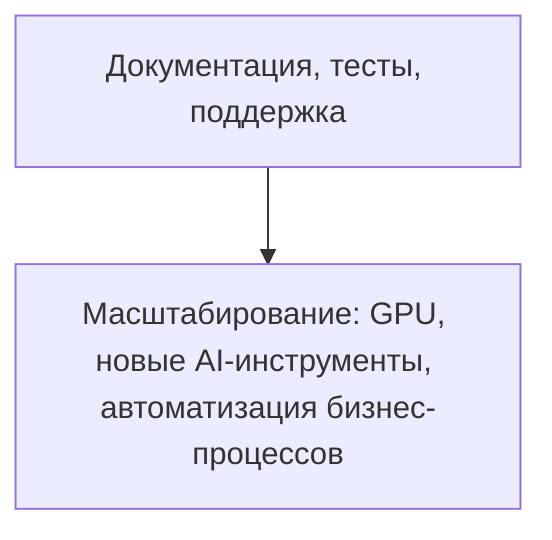

# TODO: Документация, тесты, поддержка

- [ ] Документация по API и архитектуре
- [ ] README для разработчиков
- [ ] Чек-листы для тестирования
- [ ] Система поддержки (FAQ, тикеты, help center)
- [ ] Настроить кеширование (Redis, CDN, API-ответы)
- [ ] Заложить stateless-архитектуру для масштабирования
- [ ] Подключить очереди для фоновых задач (RabbitMQ/Redis Streams)
- [ ] Настроить мониторинг и алерты (Prometheus/Grafana/Sentry)
- [ ] Реализовать rate limiting и throttling для API

